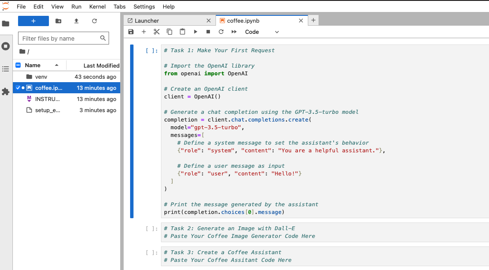

# Coffee.ai

## Introduction

Welcome to the "Coffee.ai" lab! You are a successful coffee roaster that wants to elevate your brand and harness the power of AI. You decide to add a Coffee assistant to your website where visitors can ask questions, learn about coffee and your prooducts.

In this lab, you will utilize Jupyter Notebook and the OpenAI API to create your Coffee.ai tool. 

Let's get started!

### Pre-requisites

- Basic knowledge of Python.
- Familiarity with Jupyter Notebook.
- OpenAI API key (sign up at https:/platform.openai.com/api-keys/ if you don't have one).

### Learning Objectives

- Use Jupyter Notebook for interactive development.
- Integrate OpenAI API to process natural language data.
- Create a summary tool for group chat messages.

---

## 🚀 Setting Up Your Environment

Before we build our tool, we need to set up our environment for success. Luckily there is an automated script that will do this for you, just follow the steps below.

#### 🎯 Steps:

- **Clone the Repository:**
    - Open your terminal
    ```bash
    git clone https://github.com/sullysaurus/coffee.git
    ```

 - **Navigate to the Project Directory:**
    ```bash
    cd coffee
    ```

- **Run the Environment Setup Script:**
    - Make sure the script has executable permissions:
    ```bash
    chmod +x setup_environment.sh
    ```

    - Set up the envirinment
    ```bash
    ./setup_environment.sh
    ```

    - The script will install all of the necessary dependencies.

    - It will then launch Jupyter and you should see the following in your local browser.

    

- **Set your OpenAI API key**

    - You will need an openai key to successfully run this application which you can obtain here https://platform.openai.com/api-keys. (you will also need to purchase OpenAI tokens)
    
    - Run the following command in your terminal, replacing yourkey with your API key. 

    ```bash
    echo "export OPENAI_API_KEY='yourkey'" >> ~/.zshrc

    or 

    echo "export OPENAI_API_KEY='yourkey'" >> ~/.bash_profile
    ```

    - Update the shell with the new variable:

    ```bash
    source ~/.zshrc 
    
    or 
   
    source ~/.bash_profile
    ```

    - Confirm that you have set your environment variable using the following command. 

    ```bash
    echo $OPENAI_API_KEY
    ```

---

## 💬 Task 1: Make Your First Request

#### 🎯 Task:

- Let's do a quick test to make sure our environment is working properly and we can successfully make OpenAI requests. 

- Inside your Jupyter Notebook file click into the first cell. 

- You should see the following code.

```python
# Import the OpenAI library
from openai import OpenAI

# Create an OpenAI client
client = OpenAI()

# Generate a chat completion using the GPT-3.5-turbo model
completion = client.chat.completions.create(
  model="gpt-3.5-turbo",
  messages=[
    # Define a system message to set the assistant's behavior
    {"role": "system", "content": "You are a helpful assistant."},

    # Define a user message as input
    {"role": "user", "content": "Hello!"}
  ]
)

# Print the message generated by the assistant
print(completion.choices[0].message)

```

- This code is taken right from the OpenAI docs which you can find here https://platform.openai.com/docs/api-reference/chat/create.

- Click the `Play` button or hit `Enter` on your keyboard to execute the code. 

- If everything is set up correctly you should see the following output.

```python
ChatCompletionMessage(content='Hello! How can I assist you today?', role='assistant', function_call=None, tool_calls=None)
```

- Great! Let's move on and create our coffee assistant.

---

## 💬 Task 2: Generate an Image with Dall-E

#### 🎯 Task:

- Since we want our coffee assistant to wow and delight our users, we'll need some imagery to grab attention. Rather than finding an image online, let's create one!

- Take a look through each line of code to gain an understanding of how this code is workring. 

- When you are ready, copy and paste it into the second cell inside your Jupyter Notebook and run it.


```python
# Import necessary libraries
from openai import OpenAI  # Import the OpenAI library
from IPython.display import Image, display  # Import Image and display for displaying the generated image

# Create an OpenAI client
client = OpenAI()  # Initialize an OpenAI client for API calls

# Generate a photo using the DALL-E model
response = client.images.generate(
    model="dall-e-3",  # Specify the DALL-E model
    prompt="A delicious cup of coffee",  # Describe what you want in the image
    n=1,  # Generate a single image
    size="1024x1024"  # Specify the desired image size
)

# Extract the URL of the generated image from the response
image_url = response.data[0].url

# Display the generated image in the Jupyter Notebook cell
display(Image(url=image_url))  # Display the image using the Image() and display() functions

```

- Did you see a beatufiul cup of coffee?


- If yes then congratuatlions!

- Let's move on and create the interactive part of our application.

---


## 💬 Task 3: Create a Coffee Assistant with Chat Completions

#### 🎯 Task:


- The following code should look slightly familiar to the first request we made in Task 1.

- Again we are using the chat completion api, but this time instead of hardcoding the user's input, we are taking it in via a form. 

- Additionally, we are limiting the response to 50 tokens, mainly for time...but there are other reasons to do this (tokens cost money)

- Take a look through the code to become familiar and when you are ready, paste it into your notebook and run it.


```python
# Import the OpenAI library
from openai import OpenAI

# Create an OpenAI client
client = OpenAI()

# Prompt the user to input a question about coffee
user_question = input("Ask me anything about coffee!")

# Define the maximum number of tokens you want in the response
max_response_tokens = 100  # Adjust this number as needed

# Generate a chat completion using the GPT-3.5-turbo model
completion = client.chat.completions.create(
    model="gpt-3.5-turbo",  # Specify the GPT-3.5-turbo model
    messages=[
        {
            "role": "system",
            "content": "You are a coffee expert who can give advice on how to make coffee, espresso, americano's and other popular drinks. You are also knowledgeable about the type of equipment you can buy and use to roast and make coffee."
        },
        {
            "role": "user",
            "content": user_question  # Use the user's input as a question
        }
    ],
    max_tokens=max_response_tokens  # Set the maximum number of tokens
)

# Extract the response message from the completion
response_message = completion.choices[0].message

# Print the response message
print(response_message.content)  # Display the generated response message
```

- At this point you should have a fully functional Coffee Assistant! Time to tell your customers and profit!
---


## 🛠️ Conclusion and Next Steps

- Congratulations! You've successfully created an AI-powered Coffee Assistant using Jupyter Notebook and OpenAI. Feel free to explore advanced NLP techniques or deploy the tool as a web service for broader use.

### 💡 Next Steps for Practice:

- Explore different OpenAI models and fine-tuning options.
- Implement a graphical user interface (GUI) for a user-friendly experience.
- Deploy the tool as a web application using frameworks like Flask or Streamlit.
